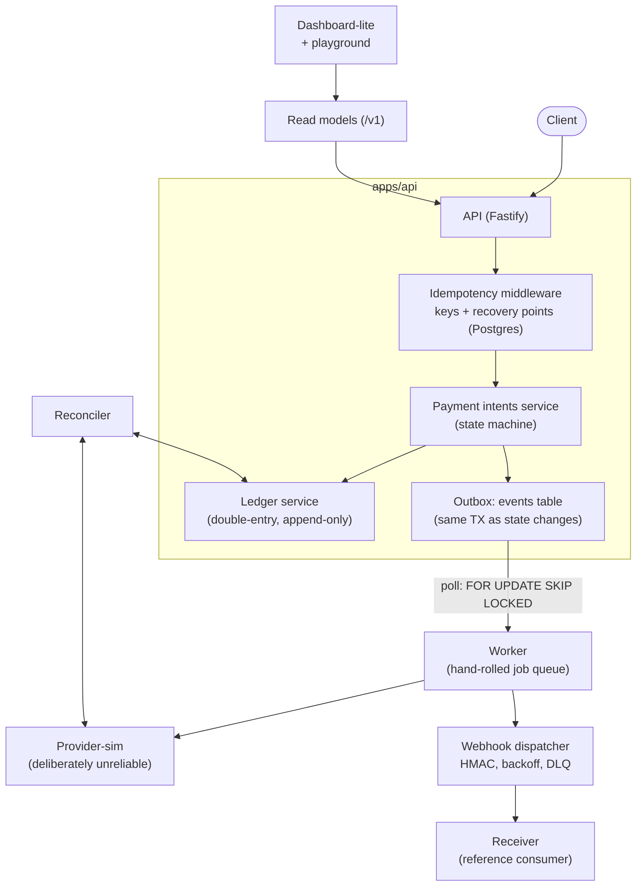

# Reckon

> A payments engine that proves it can't lose money.

Idempotent payment intents, an append-only double-entry ledger, and a reconciler that holds drift at zero — even while the system is killed mid-flight.

## Architecture



## Guarantees

Every number below is reproduced by a committed script. None are estimates.

**Chaos run** (`npm run chaos`, 10,000 intents while the worker is SIGKILLed every 5–15s, the provider failure profile flips every 10s, and delivered webhooks are randomly redelivered):

| Assertion                | Result                                                                     |
| ------------------------ | -------------------------------------------------------------------------- |
| Intents terminal         | 8,382 succeeded / 1,618 failed (adversarial declines) / **0 non-terminal** |
| Ledger drift             | **0** minor units; the whole ledger sums to 0                              |
| Worker SIGKILLs survived | 4 (jobs resumed by the sweeper + completer)                                |
| Webhook events           | **20,100 / 20,100** delivered (0 dead, 0 pending)                          |
| Injected redeliveries    | **21 / 21** deduped by the reference receiver                              |
| Reconciler exit code     | 0                                                                          |
| Wall time                | 45.3s                                                                      |

**Signature test** (in CI on every push): the same request fired 50× concurrently produces exactly **1 intent, 1 provider charge, 1 ledger charge transaction, and 50 byte-identical responses**.

**Test suite**: 83 tests green — 50 unit (including a 1,000-transaction ledger property test) and 33 integration tests against real Postgres via Testcontainers. No mocked infrastructure.

**Benchmarks** (`npm run bench` against the booted compose stack; Node, local Docker, M-series laptop — reproduce on your own hardware). Numbers below are the **median of 3 runs**; run-to-run RPS varies ±~30% on a shared laptop (this measurement box was co-resident with two other full Docker stacks). The committed `bench-results.json` is the most recent single run. See `docs/PERFORMANCE.md` for the controlled before/after of the round-trip optimizations.

| scenario                           | conc |     n | p50 ms | p95 ms | p99 ms |        RPS |
| ---------------------------------- | ---: | ----: | -----: | -----: | -----: | ---------: |
| create (unique key)                |    1 |   500 |   10.0 |   16.6 |   25.9 |         93 |
| create (unique key)                |    8 |   500 |   15.4 |   27.5 |   43.8 |        480 |
| create (unique key)                |   32 |   500 |   54.0 |   86.4 |   94.6 |        524 |
| create (unique key)                |   64 |   500 |  116.7 |  207.8 |  215.0 |        411 |
| replay (finished key)              |    1 |   500 |    0.6 |    2.3 |    3.4 |      1,156 |
| replay (finished key)              |    8 |   500 |    1.7 |    3.9 |    4.6 |      4,293 |
| replay (finished key)              |   32 |   500 |    6.4 |    9.4 |   10.4 |      4,795 |
| replay (finished key)              |   64 |   500 |   15.0 |   29.8 |   30.6 |      4,089 |
| ledger postTransaction, sequential |    1 | 1,000 |    0.6 |    1.3 |    2.6 | 1,328 tx/s |
| ledger postTransaction, 8 clients  |    8 | 2,000 |    1.5 |    3.7 |    4.7 | 4,310 tx/s |

The replay rows are the point of the idempotency design: a finished key never re-enters the pipeline, it serves the stored response straight from Postgres — an order of magnitude faster than doing the work, and always byte-identical.

A create was profiled down from **32 to 26 sequential DB round-trips** (4 → 3 write transactions) by caching the immutable chart-of-accounts per process and merging the two pure-DB terminal phases (ledger post + finish) into one transaction — with the crash-safety and idempotency-fencing invariants unchanged. Full methodology and before/after in `docs/PERFORMANCE.md`.

## Demo

The playground below runs the whole system live. [docs/demo.md](docs/demo.md) is a 90-second walkthrough script for the same tour.

## Quickstart

```sh
docker compose up -d --wait     # postgres, migrate+seed, api, worker, provider-sim, receiver, dashboard
open http://localhost:4801/playground.html
```

Interactive API docs (OpenAPI 3.1, served fully offline) at http://localhost:4800/docs — raw spec at http://localhost:4800/openapi.json.

The playground fires real payments. "Double-submit ×5" sends five concurrent identical requests so you can watch idempotency produce five byte-identical responses and a single provider charge. The provider chaos panel flips the simulated card provider into declines or timeouts-after-charge; the intent feed shows failures, retries and recovery live. That panel drives an unauthenticated provider-config passthrough, so it is a **demo-only control gated behind `ENABLE_PROVIDER_CONFIG=1`** (set in compose; off everywhere else — see docs/DECISIONS.md).

Host ports: `4800` api · `4801` dashboard · `4802` provider-sim · `4803` receiver · `5433` postgres.

Curl a payment directly:

```sh
curl -s -X POST http://localhost:4800/v1/payment_intents \
  -H 'content-type: application/json' \
  -H 'idempotency-key: demo-1' \
  -d '{"amount_minor": 4999, "currency": "USD"}'
```

Run it twice: the second response is the stored first one, byte for byte.

`amount_minor` is in minor units (cents) and bounded to `[50, 9007199254740991]`: below 50 the fixed `+30` fee would exceed the charge, and above 2^53−1 a JSON-number amount loses precision (see docs/DECISIONS.md). Out-of-range or non-numeric amounts are rejected with `400`.

### Development

```sh
npm install
docker compose up -d postgres          # just the database (host port 5433)
npm run migrate -w packages/db         # node-pg-migrate
npm run seed -w packages/db            # merchant + platform accounts
npm test                               # unit + integration (integration needs Docker)
npm run chaos -- --intents 500         # quick chaos run; full run: npm run chaos
npm run bench                          # needs the full compose stack up
npm run reconcile                      # one CI-able reconciliation pass, exit != 0 on drift
```

Configuration is environment variables with working defaults; [.env.example](.env.example) documents every knob (ports, lock timeouts, retry/backoff policy, visibility timeout, reconcile cadence). Nothing reads `.env` automatically — compose sets what each container needs.

## Consuming webhooks

Reckon signs every delivery and retries until your endpoint acknowledges. Three rules make consumption safe:

**1. Verify the signature against the raw body.** The `Reckon-Signature` header is

```
Reckon-Signature: t=<unix seconds>,v1=<hex HMAC-SHA256(secret, "<t>.<raw body>")>
```

The timestamp is inside the signed payload, so a captured signature cannot be replayed later with a fresh `t`. Verify with a constant-time compare, never against a re-serialized parse of the JSON:

```ts
import { createHmac, timingSafeEqual } from 'node:crypto';

function verify(secret: string, header: string, rawBody: string): boolean {
  const match = /^t=(\d+),v1=([0-9a-f]{64})$/.exec(header);
  if (match === null) return false;
  const [, t, given] = match;
  if (Math.abs(Date.now() - Number(t) * 1000) > 5 * 60 * 1000) return false; // stale
  const expected = createHmac('sha256', secret).update(`${t}.${rawBody}`).digest();
  const givenBuf = Buffer.from(given ?? '', 'hex');
  return givenBuf.length === expected.length && timingSafeEqual(givenBuf, expected);
}
```

**2. Reject stale timestamps.** Default tolerance is 5 minutes. This bounds the replay window to the tolerance you choose.

**3. Dedupe on the event `id`.** Delivery is at-least-once: a delivery that succeeds after your endpoint processed it but before Reckon recorded the 2xx will be sent again. Persist processed event ids and treat a repeat as an acknowledged no-op. The demo receiver in [apps/receiver](apps/receiver/src/app.ts) is the reference implementation of all three rules; the chaos run injects deliberate redeliveries and asserts every one is deduped.

Retry schedule: exponential backoff `1s · 2^n` with jitter, capped, 10 attempts, then the delivery is dead-lettered. Dead deliveries are listed at `GET /v1/deliveries?status=dead` and can be requeued with `POST /v1/deliveries/:id/requeue` (or the button in the dashboard's DLQ view). Respond `2xx` quickly and do the work async; anything else counts as a failed attempt.

## Design references

Patterns studied, then implemented from notes — no code was copied from any of these:

- [brandur/rocket-rides-atomic](https://github.com/brandur/rocket-rides-atomic) and the [idempotency keys essay](https://brandur.org/idempotency-keys) — idempotency keys with recovery points, atomic phases, resume-after-crash. The centerpiece of `apps/api/src/pipeline.ts`.
- [timgit/pg-boss](https://github.com/timgit/pg-boss) (the SQL) and [graphile/worker](https://github.com/graphile/worker) — `FOR UPDATE SKIP LOCKED` claim loops and job lifecycle columns, studied for the hand-rolled queue in `packages/core/src/queue.ts`.
- [hibiken/asynq](https://github.com/hibiken/asynq) — visibility timeouts: claimed-but-dead work re-enters the pool. The worker's heartbeat + sweeper design.
- [TigerBeetle design docs](https://docs.tigerbeetle.com/concepts/debit-credit/) and [formancehq/ledger](https://github.com/formancehq/ledger) — debit/credit invariants, append-only money, balances as derived state.
- [Stripe's API docs](https://docs.stripe.com/webhooks) — the webhook signature scheme, consumer guidance shape, and the general standard this repo's docs aim at.
- [statelyai/xstate concept docs](https://stately.ai/docs/state-machines-and-statecharts) — states/transitions/guards as a formalism for the hand-rolled intent machine.
